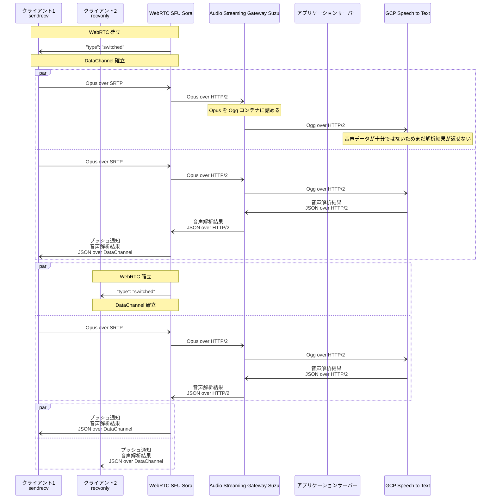

# Audio Streaming Gateway Suzu

[](https://github.com/shiguredo/suzu)
[](https://opensource.org/licenses/Apache-2.0)

## About Shiguredo's open source software

We will not respond to PRs or issues that have not been discussed on Discord. Also, Discord is only available in Japanese.

Please read https://github.com/shiguredo/oss/blob/master/README.en.md before use.

## 時雨堂のオープンソースソフトウェアについて

利用前に https://github.com/shiguredo/oss をお読みください。

## Audio Streaming Gateway Suzu について

Suzu は [WebRTC SFU Sora](https://sora.shiguredo.jp) 専用の音声解析用ゲートウェイです。
Suzu は Sora から送られてくる音声ストリーミングを HTTP/2 経由で受け取り、音声解析サービスに転送し、その解析結果を Sora に送ります。
Sora は Suzu から送られてきた解析結果を、プッシュ API を経由してリアルタイムにクライアントへ通知します。

## 目的

リアルタイム通話で気軽に音声解析サービスを利用できる仕組みを提供することです。

## 特徴

- Sora から音声データを HTTP/2 経由で受け取り、音声解析サービスへ送信します
- 音声解析サービスの解析結果を HTTP/2 レスポンスで Sora に戻します
- Sora は受け取った解析結果をクライアントへプッシュで送信します
    - [DataChannel 経由のシグナリング](https://sora-doc.shiguredo.jp/DATA_CHANNEL_SIGNALING) の利用を推奨します
- 音声解析に必要とされる言語コードをクライアントごとに指定できます
- mTLS 対応

## 使ってみる

Suzu を使ってみたい人は [USE.md](doc/USE.md) をお読みください。

## Suzu と GCP Speech to Text



## 対応サービス

- [x] [Amazon Transcribe](https://aws.amazon.com/jp/transcribe/)
- [x] [Google Cloud Speech-to-Text](https://cloud.google.com/speech-to-text)
- [ ] [Microsoft Azure Speech to Text](https://azure.microsoft.com/ja-jp/products/cognitive-services/speech-to-text/)
- [ ] [Microsoft Azure Speech Translation](https://azure.microsoft.com/ja-jp/products/cognitive-services/speech-translation/)
- [ ] [Deepgram](https://deepgram.com/)
- [ ] [AmiVoice Cloud Platform](https://acp.amivoice.com/amivoice/)

## ライセンス

```
Copyright 2022-2023, Hiroshi Yoshida (Original Author)
Copyright 2022-2023, Shiguredo Inc.

Licensed under the Apache License, Version 2.0 (the "License");
you may not use this file except in compliance with the License.
You may obtain a copy of the License at

    http://www.apache.org/licenses/LICENSE-2.0

Unless required by applicable law or agreed to in writing, software
distributed under the License is distributed on an "AS IS" BASIS,
WITHOUT WARRANTIES OR CONDITIONS OF ANY KIND, either express or implied.
See the License for the specific language governing permissions and
limitations under the License.
```

## 優先実装

優先実装とは Sora のライセンスを契約頂いているお客様限定で Suzu の実装予定機能を有償にて前倒しで実装することです。

### 優先実装が可能な機能一覧

詳細は Discord やメールなどでお気軽にお問い合わせください。

- [Microsoft Azure Speech to Text](https://azure.microsoft.com/ja-jp/products/cognitive-services/speech-to-text/) 対応
- [Microsoft Azure Speech Translation](https://azure.microsoft.com/ja-jp/products/cognitive-services/speech-translation/) 対応
- [Deepgram](https://deepgram.com/) 対応
- [AmiVoice Cloud Platform](https://acp.amivoice.com/amivoice/) 対応
- [ggerganov/whisper\.cpp: Port of OpenAI's Whisper model in C/C\+\+](https://github.com/ggerganov/whisper.cpp) 対応
    - Suzu から利用できるようになる Whisper サーバーを開発し、OSS として公開します
- ウェブフック機能対応
    - クライアントごとに接続先サービスを変更できるようになる
